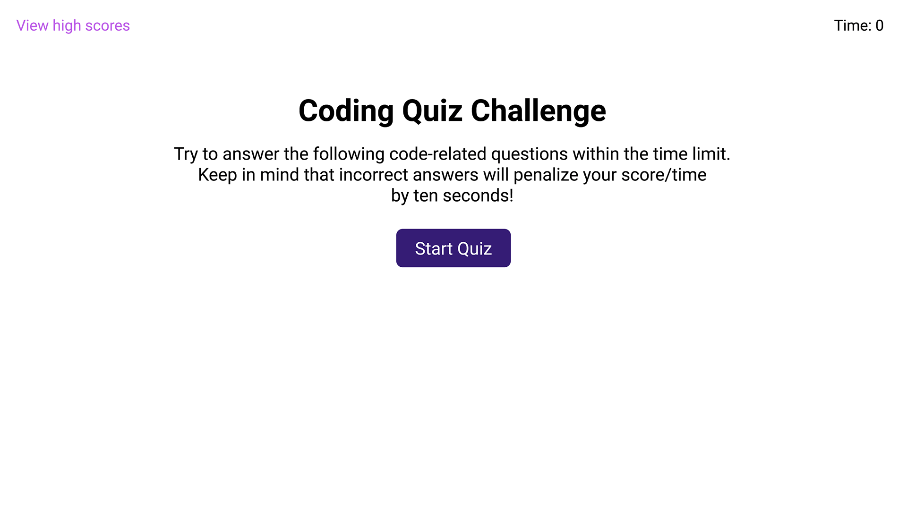

# Web API: Coding-Quiz

If you want to becoming a full-stack web developer, it’s likely that you’ll be asked to complete a coding assessment, perhaps as part of an interview process. A typical coding assessment is a combination of multiple-choice questions and interactive coding challenges.

To help you become familiar with these tests is this timed coding quiz with multiple-choice questions. The app runs in the browser, and features dynamically updated HTML and CSS powered by JavaScript code that you write. It has a clean, polished, and responsive user interface.

## Table of Contents

- [User-Story](#User-Story)
- [Acceptance-Criteria](#Acceptance-Criteria)
- [Demo](#Demo)
- [Live Application](#Live-Application)

## User Story

```md
AS A coding boot camp student
I WANT to take a timed quiz on JavaScript fundamentals that stores high scores
SO THAT I can gauge my progress compared to my peers
```

## Acceptance Criteria

```md
GIVEN I am taking a code quiz
WHEN I click the start button
THEN a timer starts and I am presented with a question
WHEN I answer a question
THEN I am presented with another question
WHEN I answer a question incorrectly
THEN time is subtracted from the clock
WHEN all questions are answered or the timer reaches 0
THEN the game is over
WHEN the game is over
THEN I can save my initials and score
```

## Demo

The following animation demonstrates the application functionality:

[](https://xndroli.github.io/Coding-Quiz/assets/html/index.html)

## Live Application

[See Live Coding Quiz App](https://xndroli.github.io/Coding-Quiz/assets/html/index.html)

---

© 2022 xndroli. Confidential and Proprietary. All Rights Reserved.
